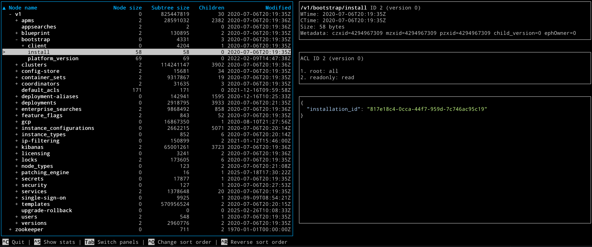

# Zooxplorer

Zooxplorer is a simple TUI app to explore a ZooKeeper snapshot file.



## Run from the command line

```bash
go run ./cmd/zooxplorer ./path/to/snapshot.file
```

The snapshot file path is required.

## Basic navigation

- `Up` / `Down`: move selection in the tree (or scroll content when content pane is focused)
- `PageUp` / `PageDown`: move one page up/down in the tree table
- `Home` / `End`: jump to first/last row in the tree table
- `Left` / `Right`: collapse / expand selected tree node
- `Alt+Up` (Option+Up): jump to parent node in the tree
- `Tab`: switch focus between tree and content panes

## Sorting

- `Ctrl+O`: switch to the next sort column in the tree table
- `Ctrl+R`: reverse sort order for the current sort column

# Other

- `Ctrl+S`: open snapshot statistics dialog (press any key to close)
- `Ctrl+C`: quit application

## What it shows

- Tree view with expandable/collapsible znodes
- Node metadata (path, timestamps, size, zxid/cversion/owner fields)
- ACL details (ACL ID/version and decoded ACL entries)
- Node content with JSON pretty-printing and syntax highlighting, and gzip auto-decompression

## Important disclaimer

This whole application was vibecoded: all code was written by AI, and I did not review a single line of code.

This project is not meant for any serious application, and there is no guarantee that it works correctly.
